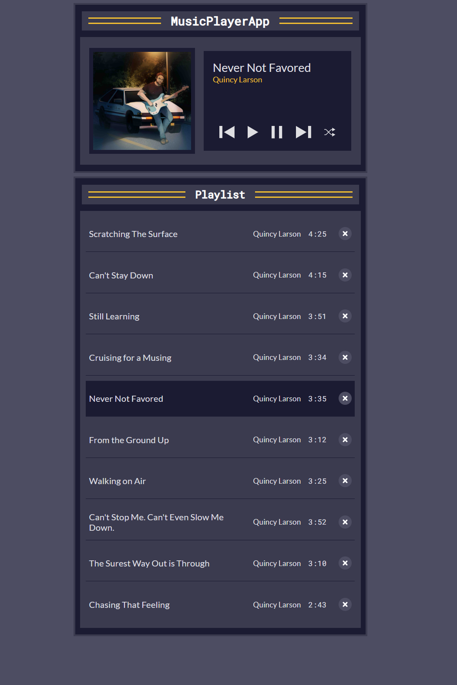

# musicPlayer

## Overview

Welcome to the Music Player App! This simple web application allows you to create and manage your playlist with a user-friendly interface.

## Features

- **Play, Pause, Next, and Previous:**

  - Control playback with easy-to-use buttons.
  - Navigate through your playlist effortlessly.

- **Shuffle:**

  - Shuffle your playlist for a randomized listening experience.

- **Dynamic Playlist:**
  - Add, delete, and play songs from your playlist.
  - See song details such as title, artist, and duration.

## How to Use

1. **Play/Pause:**

   - Click the "Play" button to start playing the first song in your playlist.
   - Click the "Pause" button to pause the currently playing song.

2. **Next/Previous:**

   - Navigate to the next song using the "Next" button.
   - Go back to the previous song with the "Previous" button.

3. **Shuffle:**

   - Click the "Shuffle" button to randomize the order of your playlist.

4. **Manage Playlist:**
   - View and manage your playlist on the left side of the player.
   - Delete a song by clicking the delete button next to it.

## Technologies Used

- HTML
- JavaScript

## App

